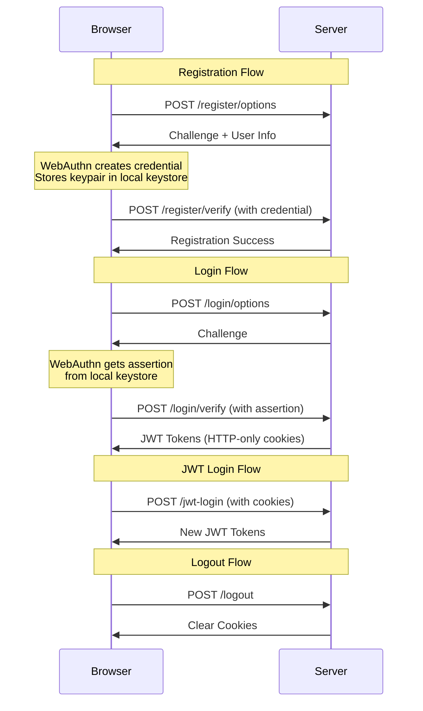

# WebAuthn Passwordless Authentication with JWT Session Management

A complete FastAPI implementation of WebAuthn (Web Authentication) for passwordless authentication using biometrics, security keys, or platform authenticators. Features secure JWT session management with HTTP-only cookies (for easy development, use HTTPS in PROD) and a comprehensive step-by-step test interface.

## Features

- **Passwordless Registration** - Users register with biometrics/security keys  
- **Passwordless Authentication** - Secure login without passwords
- **JWT Session Management** - HTTP-only cookies with access/refresh tokens
- **Multi-Device Support** - Register and use multiple devices per user
- **WebAuthn Standard** - Uses W3C WebAuthn specification
- **FastAPI Framework** - Modern, fast web framework with automatic API docs
- **Interactive Test Interface** - Complete step-by-step workflow testing
- **In-Memory Storage** - Simple development setup (not for production)

## Technology Stack

- **FastAPI** - Modern Python web framework with automatic OpenAPI
- **WebAuthn** - W3C Web Authentication standard for passwordless auth
- **PyJWT** - JSON Web Token implementation for session management
- **Python 3.12+** - Programming language
- **Uvicorn** - ASGI server for production-ready performance

## Prerequisites

- Python 3.12 or higher
- A device with WebAuthn support (fingerprint reader, Face ID, security key, etc.)
- Modern browser with WebAuthn support (Chrome, Firefox, Safari, Edge)

## Installation

1. **Clone the repository**
   ```bash
   git clone <your-repo-url>
   cd passwordless_auth_seamless_jwt
   ```

2. **Create and activate virtual environment**
   ```bash
   python -m venv .venv
   source .venv/bin/activate  # On Windows: .venv\Scripts\activate
   ```

3. **Install dependencies**
   ```bash
   pip install -r requirements.txt
   ```

## Running the Application

1. **Start the FastAPI server**
   ```bash
   python main.py
   # or with uvicorn directly:
   uvicorn main:app --reload --host localhost --port 8000
   ```

2. **Access the application**
   - **Test Interface**: http://localhost:8000/static/test.html (or http://localhost:8000/test.html) - do not use http://127.0.0.1 you will encounter security issues.
   - **API Documentation**: http://localhost:8000/docs
   - **Alternative API docs**: http://localhost:8000/redoc

## Complete Test Interface (`test.html`)

The application includes a comprehensive guided test interface that walks you through the entire passwordless authentication workflow. This interface demonstrates all features and provides detailed feedback for each step.

### How to Use the Test Interface

1. **Start the server and open the test page**
   - open http://localhost:8000/test.html -- IMPORTANT DO NOT USE HTTP:127.0.0.1 due to security reasons it will not work 


2. **Follow the 4-step guided workflow:**

#### **Step 1: Device Registration**
   - Enter your email address (default: `test@example.com`)
   - Click **"Get Register Options"** to fetch registration challenge from server
   - Click **"Complete Registration"** to register your device
   - Follow browser prompts for biometric authentication or security key
   - Success: Device cryptographic key pair created and stored

#### **Step 2: Device Authentication** 
   - Enter the same email address used for registration
   - Click **"Get Login Options"** to fetch authentication challenge
   - Click **"Complete Authentication"** to authenticate with your device  
   - Use the same authentication method as registration
   - Success: JWT access and refresh tokens issued as HTTP-only cookies

#### **Step 3: JWT Session Usage**
   - Click **"Call Protected Endpoint"** to test JWT cookie authentication
   - The server validates your access token automatically
   - View your decoded JWT payload with user info and device ID
   - Success: Protected API access with automatic JWT validation

#### **Step 4: Token Management**
   - Click **"Refresh Access Token"** to extend your session
   - Uses refresh token to mint a new access token
   - Click **"Logout"** to clear all authentication cookies
   - Success: Session management and secure logout


### Flow Overview
```
Registration: Email → Challenge → Device Auth → Store Credential
Authentication: Email → Challenge → Device Auth → Issue JWT Cookies  
API Access: HTTP Request → Cookie JWT Validation → Protected Resource
Token Refresh: Refresh Cookie → Validate → Issue New Access Cookie
Logout: Clear Cookies → Terminate Session
```

### Detailed Step-by-Step Process

### **Registration Flow (Create New Device Credential)**

1. **POST `/register/options`** – Client requests registration options.  
2. **Server** generates a challenge and user info.  
3. **Browser/WebAuthn API** – Client calls WebAuthn API with options.  
4. **User Authenticates** – Browser prompts for biometric/security key authentication.  
5. **POST `/register/verify`** – Client sends credential to server for verification.  
6. **Server** verifies and stores credential.

---

### **Authentication Flow (Login with Existing Device)**

1. **POST `/login/options`** – Client requests authentication options.  
2. **Server** generates challenge and allowed credentials.  
3. **Browser/WebAuthn API** – Client calls WebAuthn API for authentication.  
4. **User Authenticates** – Browser prompts for authentication with same method as registration.  
5. **POST `/login/verify`** – Client sends assertion to server.  
6. **Server** verifies signature and issues **JWT cookies** (`access_token`, `refresh_token`).

---

### **Protected API Access (Using JWT Session)**

1. **GET `/api/protected`** – Client makes API request (cookies sent automatically).  
2. **Server** validates access token from cookie.  
3. **Protected endpoint** receives verified user info.

---

### **Token Refresh (Extend Session)**

1. **POST `/auth/refresh`** – Client requests token refresh.  
2. **Server** validates refresh token and issues new access token.



### Security Features

**WebAuthn Security:**
- **Public Key Cryptography** - Private keys never leave the device
- **Challenge-Response** - Prevents replay attacks with unique nonces
- **Origin Validation** - Ensures requests come from correct domain
- **Device Binding** - Credentials tied to specific authenticator

**JWT Security:**

- **Short Token Expiry** - Limits exposure window (15 minutes)
- **Refresh Token Rotation** - Allows session extension without re-auth
- **SameSite Protection** - Prevents CSRF attacks

**Multi-Device Support:**
- **Credential Exclusion** - Prevents duplicate device registration
- **Device Identification** - Each device gets unique credential ID
- **Counter Validation** - Detects cloned authenticators

## Development vs Production

**Development Features:**
- **In-memory storage** - Data lost on restart, simple for testing
- **HTTP localhost** - Works without SSL certificates
- **Hardcoded secrets** - No environment variable complexity
- **Basic error handling** - Sufficient for development and testing
- **No rate limiting** - Simple development setup

### **Production Requirements**

For production deployment, implement these critical changes:

**1. Database Storage**  
Replace in-memory dictionaries with persistent storage (e.g., PostgreSQL, MongoDB, or SQLite for user credentials).  
Use Redis with TTL for temporary challenges.  

**2. Environment Configuration**  
Move all secrets (JWT keys, database URLs, RP ID, origin) to environment variables.  
Load them via `.env` files or your cloud environment configuration.  

**3. HTTPS and Domain Configuration**  
Use your real production domain and enforce HTTPS.  
Enable secure cookie settings with `httponly`, `secure`, `samesite="strict"`, and an explicit domain name.  

**4. Security Enhancements**  
Add rate limiting to prevent abuse of registration and login endpoints.  
Use input validation (e.g., Pydantic for email format checking).  
Implement detailed logging with both file and console handlers for monitoring and auditing.

## Testing and Debugging

### Using Browser Developer Tools

1. **Open Developer Tools** (F12)
2. **Monitor Network Tab** - See all API requests/responses
3. **Check Console Tab** - View detailed JavaScript logs
4. **Application Tab** - Inspect cookies and local storage

*

### Common Issues and Solutions

**Issue: "The operation is insecure"**
- **Cause**: WebAuthn requires HTTPS or localhost
- **Solution**: Ensure using `http://localhost:8000` or `https://yourdomain.com`

**Issue: "No authenticator available"**  
- **Cause**: No biometric device or security key available
- **Solution**: Use device with Touch ID, Face ID, fingerprint reader, or USB security key

**Issue: "Invalid challenge"**
- **Cause**: Challenge expired or browser/server out of sync
- **Solution**: Refresh page and try again, challenges expire after use

**Issue: "Credential creation/retrieval failed"**
- **Cause**: User cancelled authentication or hardware error
- **Solution**: Retry with same authentication method used during registration

**Issue: "JWT token validation failed"**
- **Cause**: Token expired, invalid signature, or missing cookies
- **Solution**: Check browser cookies, try refresh token endpoint, or re-authenticate

## Project Structure

```
passwordless_auth_seamless_jwt/
├── main.py                 # FastAPI application with all endpoints
├── static/                 # Static files served by FastAPI
│   ├── test.html          # Comprehensive test interface (main testing tool)
│   └── index.html         # Simple redirect to test.html
├── requirements.txt        # Python dependencies (FastAPI, webauthn, PyJWT, etc.)
├── .venv/                 # Virtual environment (created during setup)
├── __pycache__/           # Python bytecode cache
├── .gitignore             # Git ignore rules
└── README.md              # This comprehensive documentation
```

### Key Files

**`main.py`** - Complete server implementation
- WebAuthn registration and authentication endpoints
- JWT token creation and validation
- HTTP-only cookie session management  
- Protected endpoint examples
- Comprehensive error handling and validation

**`static/test.html`** - AI generated TESTING interface
- Step-by-step guided workflow

## Browser Compatibility

### Supported Browsers
- **Chrome 67+** - Full WebAuthn support
- **Firefox 60+** - Full WebAuthn support  
- **Safari 14+** - Full WebAuthn support
- **Edge 18+** - Full WebAuthn support

### Platform Authenticator Support
- **Windows**: Windows Hello (fingerprint, face, PIN) – **tested**
- **macOS**: Touch ID, Face ID – expected to work
- **iOS**: Touch ID, Face ID – expected to work
- **Android**: Fingerprint, face unlock, biometric authentication – expected to work

### External Authenticator Support
- **USB Security Keys**: YubiKey, Google Titan, SoloKeys – expected to work
- **NFC**: NFC-enabled FIDO2 keys – expected to work
- **Bluetooth**: Bluetooth FIDO2 authenticators – expected to work

**Scaling Considerations:**
- **Challenge storage**: Use Redis with TTL for production
- **User storage**: PostgreSQL/MongoDB for persistent data
- **Rate limiting**: Implement per-IP and per-user limits
- **Caching**: Cache public keys and user data for faster lookups

## Quick Start Guide

1. **Setup and start**
   ```bash
   git clone <repo-url>
   cd passwordless_auth_seamless_jwt
   python -m venv .venv
   source .venv/bin/activate  # Windows: .venv\Scripts\activate
   pip install -r requirements.txt
   python main.py
   ```

2. **Test complete workflow**
   - Open: http://localhost:8000/static/test.html
   - Follow steps 1-4 in the guided interface
   - Use your fingerprint, Face ID, or security key
   - Test all features: registration → login → API access → refresh → logout

3. **Explore API docs**
   - Visit: http://localhost:8000/docs
   - Try the endpoints (note: WebAuthn requires the test interface)

## Contributing

1. **Fork the repository**
2. **Create feature branch** (`git checkout -b feature/amazing-feature`)
3. **Make your changes** with tests
4. **Follow code style** (use `black` and `isort`)
5. **Test thoroughly** with the test interface
6. **Submit pull request** with detailed description

## License

This project is provided for educational and development purposes. Add appropriate license for your production use case.

## Resources and References

### WebAuthn Resources
- **[WebAuthn Guide](https://webauthn.guide/)** - Comprehensive WebAuthn tutorial
- **[W3C WebAuthn Specification](https://www.w3.org/TR/webauthn-2/)** - Official specification
- **[WebAuthn Awesome List](https://github.com/herrjemand/awesome-webauthn)** - Curated resources
- **[FIDO Alliance](https://fidoalliance.org/)** - Industry standards organization

### FastAPI Resources  
- **[FastAPI Documentation](https://fastapi.tiangolo.com/)** - Official FastAPI docs
- **[FastAPI Tutorial](https://fastapi.tiangolo.com/tutorial/)** - Getting started guide
- **[Pydantic Documentation](https://pydantic-docs.helpmanual.io/)** - Data validation

### JWT Resources
- **[JWT Introduction](https://jwt.io/introduction)** - JWT basics and debugging
- **[PyJWT Documentation](https://pyjwt.readthedocs.io/)** - Python JWT library

### Security Resources
- **[OWASP WebAuthn Guide](https://cheatsheetseries.owasp.org/cheatsheets/WebAuthn_Cheat_Sheet.html)** - Security considerations
- **[NIST Authentication Guidelines](https://pages.nist.gov/800-63-3/)** - Government authentication standards

---

**⚠️ Production Notice**: This is a development/educational implementation. For production use, implement proper database storage, HTTPS, environment-based configuration, rate limiting, comprehensive logging, and security auditing.
